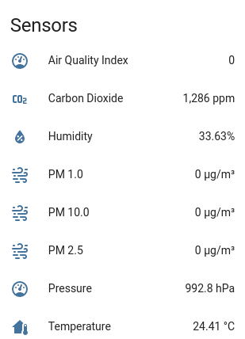
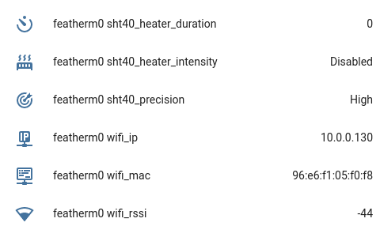

# AirMonitor #
## Indoor Environmental Sensor ##

Overview | Details
---|---
Language: | C++ 
IDE: | Platform.io (VS Code + Platform.io extension)
Microcontroller: |  Adafruit Feather M0

This custom device connects to wifi and publishes sensor readings via MQTT at the set refresh rate frequency.

This device will send Home Assistant compatible discovery messages via MQTT. It can be configured via special MQTT topics.

The software is modular and designed to be reused. It sacrifices simplicity, RAM and flash in order to minimize the amount of developer time needed to get a robust Home Assistant compliant MQTT device working. 
[Start here](lib/mqtt-ha-helper/README.md) to learn how to use the [mqtt-ha-helper](lib/mqtt-ha-helper/mqtt-ha-helper.cpp) to provide auto-discovery for sensors.
For providing auto-discovery for [static device diagnostics](lib/mqtt-ha-helper/Discovery_DiagnosticFact.md) as well as [measurable diagnostics](lib/mqtt-ha-helper/Discovery_MeasurableDiagnostic.md), the steps are slightly different. Finally to support interactive controls and remote configuration via MQTT, the device will need to listen on topics and provide state updates. The details on how to do so are [here](lib/mqtt-ha-helper/Discovery_Control.md).

Auto-discovery for:
* [sensors (start here)](lib/mqtt-ha-helper/README.md)
* [diagnostic facts](lib/mqtt-ha-helper/Discovery_DiagnosticFact.md)
* [measurable diagnostics](lib/mqtt-ha-helper/Discovery_MeasurableDiagnostic.md)
* [controls](lib/mqtt-ha-helper/Discovery_Control.md)


Sensor | Measures...
---|---
SHT40 | humidity (% RH), temperature (C)
DPS310 | temperature (C), pressure (hectopascal, hPa), altitude computed
PM2.5 | particulate matter (Particles > 0.3um, 0.5um, 1.0um, 2.5um, 5.0um, 10.0um / 0.1L air); **AQI computed**
SCD30 | carbon dioxide (PPM direct from sensor), humidity (% RH), temperature (C)

## How the Device Publishes Sensor State ##

MQTT Topic:
```
homeassistant/{device_type}/{device_id}/state 
homeassistant/sensor/featherm0/state
```

Sensor State Payload:
```
{
  "temperature": 22.05,
  "humidity": 38.25,
  "pressure": 989.4,
  "pressure_details": {
    "temperature": 21.25,
    "altitude": 281.3
  },
  "pm1": 1,
  "pm25": 1,
  "pm10": 1,
  "aqi": 4,
  "aqi_details": {
    "count_gt_03": 228,
    "count_gt_05": 68,
    "count_gt_10": 2,
    "count_gt_25": 0,
    "count_gt_50": 0,
    "count_gt_100": 0
  },
  "carbon_dioxide": 954,
  "carbon_dioxide_details": {
    "temperature": 23.5,
    "humidity": 35.54
  }
}
```

### Sensors Discovery ###



All of the following sensors use the common sensor state topic (see below):

Sensor Discovery: 
```
homeassistant/sensor/featherm0/carbon_dioxide/config
homeassistant/sensor/featherm0/aqi/config
homeassistant/sensor/featherm0/pm1/config
homeassistant/sensor/featherm0/pm25/config
homeassistant/sensor/featherm0/pm10/config
homeassistant/sensor/featherm0/pressure/config
homeassistant/sensor/featherm0/humidity/config
homeassistant/sensor/featherm0/temperature/config
```

## How the Device Publishes Diagnostics ##

```
homeassistant/{device_type}/{device_id}/diagnostics
homeassistant/sensor/featherm0/diagnostics
```

Configuration State Payload:
```
{ 
"wifi_rssi": -42, 
"wifi_ip": "10.0.0.130", 
"wifi_mac": "96:e6:f1:05:f0:f8",
"sht40_heater_intensity": "Disabled", 
"sht40_heater_duration": 0, 
"sht40_precision": "High", 
}
```

### Diagnostics Discovery ###
```
homeassistant/sensor/featherm0/wifi_rssi/config
homeassistant/sensor/featherm0/wifi_ip/config
homeassistant/sensor/featherm0/wifi_mac/config
homeassistant/sensor/featherm0/sht40_heater_intensity/config
homeassistant/sensor/featherm0/sht40_heater_duration/config
homeassistant/sensor/featherm0/sht40_precision/config
```



## How the Device Publishes Controls ##

Controls/configuration must listen on topics to accept updates (setter or command topics) and reflect those changes back to the UI (getter or state topics). Unlike sensors or diagnostics, controls have a dedicated read and write topic per control that carry a single raw value such as an integer (not JSON).


### Altitude Offset ###

Discovery: 
```
homeassistant/number/featherm0_altitude_offset/config
```
Altitude offset state: 
```
homeassistant/number/featherm0/altitude_offset/get
```
Altitude offset command: 
```
homeassistant/number/featherm0/altitude_offset/set
```

### Ambient Pressure Calibration ###

Discovery: 
```
homeassistant/switch/featherm0/use_pressure_offset/config
```
Use ambient pressure state: 
```
homeassistant/switch/featherm0/use_pressure_offset/get
```
Use ambient pressure command: 
```
homeassistant/switch/featherm0/use_pressure_offset/set
```

### Temperature Offset ###
Discovery: 
```
homeassistant/number/featherm0/temperature_offset/config
```
Temp Offset state: 
```
homeassistant/number/featherm0/temperature_offset/get
```
Temp Offset command: 
```
homeassistant/number/featherm0/temperature_offset/set
```

### Refresh Rate ###
Discovery: 
```
homeassistant/number/featherm0/refreshrate/config
```
Refresh rate state: 
```
homeassistant/number/featherm0/refreshrate/get
```
Refresh rate command: 
```
homeassistant/number/featherm0/refreshrate/set
```

## Software Dependencies ##

Feature | Library | Release
---|---|---
Wifi connectivity | https://github.com/arduino-libraries/WiFi101 | v0.16.1
MQTT connectivity | https://github.com/256dpi/arduino-mqtt | v2.5.0
DPS310 Barometric Pressure | https://github.com/adafruit/Adafruit_DPS310 | v1.1.1
SHT40 Temperature and Humidity | https://github.com/adafruit/Adafruit_SHT4X | v1.0.1
PM2.5 Air Quality | https://github.com/adafruit/Adafruit_PM25AQI | v1.0.6
SCD30 Carbon Dioxide | https://github.com/adafruit/Adafruit_SCD30 | v1.0.8

## Home Assistant Customizations ##

Update the default labels in the Home Assistant dashboard:
```
homeassistant:
  customize:
    sensor.featherm0_humidity:
      friendly_name: Humidity
    sensor.featherm0_temperature:
      friendly_name: Temperature
    sensor.featherm0_pressure:
      friendly_name: Pressure
    sensor.featherm0_aqi:
      friendly_name: Air Quality Index
    sensor.featherm0_pm1:
      friendly_name: PM 1.0
    sensor.featherm0_pm25:
      friendly_name: PM 2.5
    sensor.featherm0_pm10:
      friendly_name: PM 10.0
    sensor.featherm0_carbon_dioxide:
      friendly_name: Carbon Dioxide
    
    number.featherm0_altitude_offset:
      friendly_name: Altitude Offset [SCD30]
    number.featherm0_co2_reference:
      friendly_name: CO2 Reference [SCD30]
    number.featherm0_pressure_offset:
      friendly_name: Pressure Offset [SCD30]
    switch.featherm0_use_pressure_offset:
      friendly_name: Enable Pressure Offset [SCD30]
    number.featherm0_refreshrate:
      friendly_name: Refresh Rate
    number.featherm0_temperature_offset:
      friendly_name: Temp Offset [SCD30]
```
---
Tips:

To enable serial logging, see [log.h](lib/log/log.h)

To customize network configuration, copy [sample-env.h](src/sample-env.h) to env.h and apply your own local wifi and MQTT broker details.
