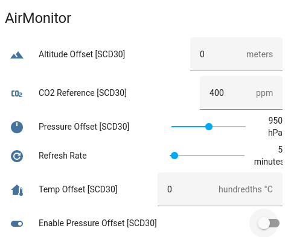

# Calibrating the CO2 Sensor

## Step 1: Apply a temperature correction

The SCD30 CO2 sensor has its own temperature and humidity sensors. The temperature is typically slightly higher than nominal due to its proximity to the sensors heating element.
You can see the the CO2 internal temperature sensor on line 23 compared to the independent temperature sensor on line 2.
This skewed temperature affects the accuracy of the CO2 and humidity reading. Correcting the temperature will have a positive affect on both other readings. 

```
01 {
02   "temperature": 22.52,
03   "humidity": 49.36,
04   "pressure": 1002.7,
05   "pressure_details": {
06     "temperature": 21.71,
07     "altitude": 110.7
08   },
09   "pm1": 5,
10   "pm25": 8,
11   "pm10": 8,
12   "aqi": 32,
13   "aqi_details": {
14     "count_gt_03": 885,
15     "count_gt_05": 282,
16     "count_gt_10": 54,
17     "count_gt_25": 2,
18     "count_gt_50": 0,
19     "count_gt_100": 0
20   },
21   "carbon_dioxide": 433,
22   "carbon_dioxide_details": {
23     "temperature": 23.33,
24     "humidity": 47.75
25   }
26 }
```

The temperature offset is exposed as a device configuration setting. It is specified in one hundredths of a degree.
So to (decrease) the CO2 temperature sensor by 1C specify 100 as the temperature offset.


## Step 2: Calibrate the CO2 sensor

The SCD30 CO2 sensor should already be pre-calibrated. However there are two ways to do it yourself. The automatic way and the forced way.
The forced way is preferrable, but requires that you know the CO2 PPM concentration that the SCD30 is sensing. 
To set this, simply set the CO2 Reference PPM in the device configuration setting. 
```
Publish 430 to : homeassistant/number/featherm0/co2_reference/set
```

The automatic way requires about 5 days of continuous sensing indoors and out and this mode is not exposed via the configuration interface. 
