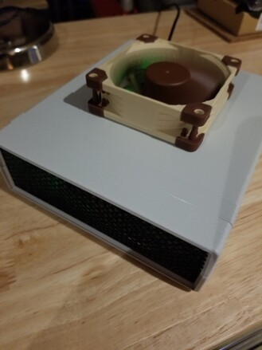
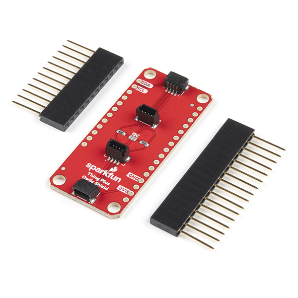
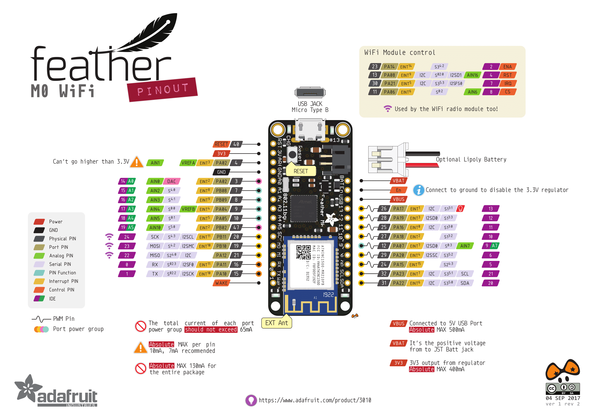
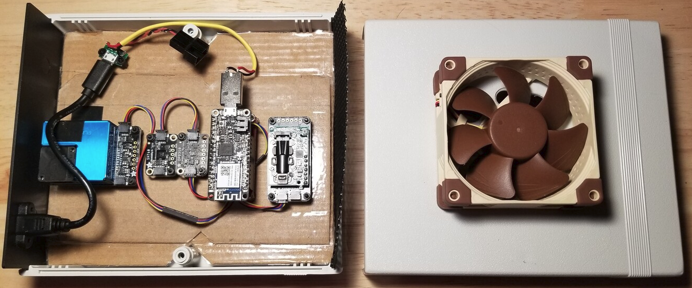

# Physical Build #

This device is based on the ATSAMD21G18 ARM Cortex M0 processor paired with an Atmel ATWINC1500 wifi module. Since the device is meant to run off of mains power, the power savings and sleep features are irrelevant. More importantly, this chip has  32K of RAM and 256K of FLASH - most of which is needed by the custom software and all the necessary library dependencies for the various sensors (FLASH is ~95% utilized). 

The build was drastically simplified by using more expensive variants of the sensors that included i2c interfaces. Therefore the build is much like LEGOs, simply daisy chain a number of i2c components together. 

From left to right: PM2.5 air quality sensor, SHT40 temperature and humidity, DPS310 pressure, Feather M0, and SCD-30 CO2 sensor. Under the Feather M0 is a i2c daughterboard.

The I2C adapter daughterboard hiding under the Feather M0.

## Hardware Parts List ##

Component | Detail | Interface | Reference
---|---|---|---
Microcontroller | Adafruit Feather M0 with ATWINC1500 wireless module | n/a | https://www.adafruit.com/product/3010
I2C Adapter | Sparkfun Thing plus | Feather daughterboard | https://www.sparkfun.com/products/16790
Barometric Pressure sensor | Adafruit DPS310 | i2c | https://www.adafruit.com/product/4494
Temperature and Humidity sensors | Adafruit Sensiron SHT40 | i2c | https://www.adafruit.com/product/4885
PM 2.5 Air Particulate sensor | Adafruit PMSA003I | i2c | https://www.adafruit.com/product/4632
Carbon Dioxide sensor | Adafruit SCD-30 - NDIR CO2 | i2c | https://www.adafruit.com/product/4867
Fan | Noctua NF-A8 5V, Premium Quiet Fan with USB Power Adaptor Cable, 3-Pin, 5V Version (80mm, Brown) | 5v/gnd | https://www.amazon.ca/gp/product/B07DXNT9J9

## Enclosure ##

The final step is fitting all these components into an enclosure. One important consideration is to ensure you gave proper ventillation. Obviously the gas and air quality sensors need airflow to function correctly. Additionally mechanically exchanging the air with a fan will prevent a temperature buildup within the case which will result in sensor inaccuracies. Small fans have an high-pitched whine to them and my first attempt was a complete annoyance. I needed something a lot quieter.

I found this new Noctua 80mm fan. They are very expensive ($20 each compared to $4 each) but are perfectly quiet and have rubber isolating attachments to dampen vibrations. 

